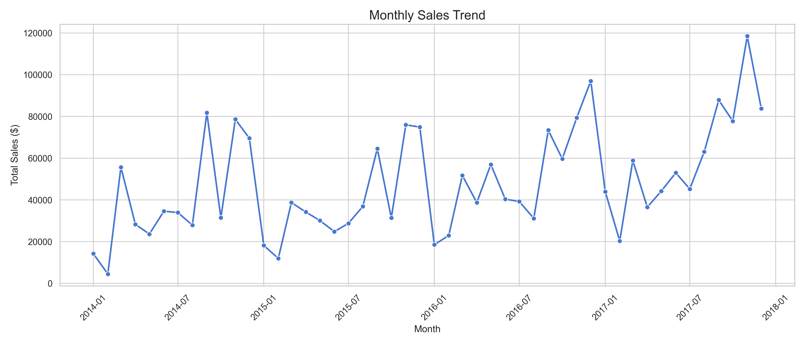
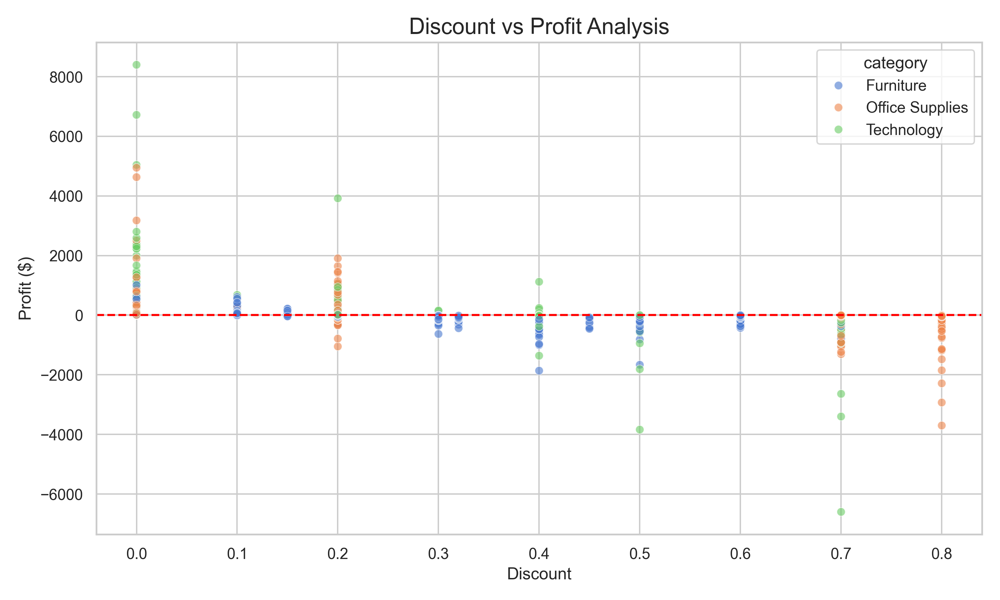
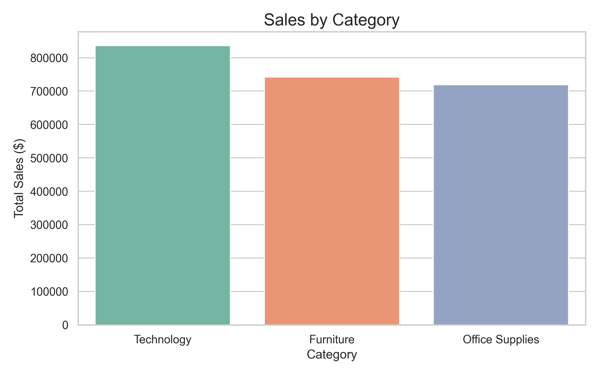

# Sales Performance Analytics Dashboard 📊

## 📌 Project Overview
This project is an end-to-end Data Analysis portfolio piece built to analyze the sales performance of a retail Superstore. The goal of this project is to clean, process, and analyze a real-world dataset to extract actionable business insights, identify profitable segments, and highlight areas causing revenue loss.

By utilizing Python and its data manipulation and visualization libraries, this project showcases my ability to turn raw data into strategic business recommendations.

## 💾 Dataset
- **Source:** [Kaggle Superstore Sales Dataset (Real Retail Data)](https://www.kaggle.com/datasets/vivek468/superstore-dataset-final)
- **Description:** Contains 4 years of retail data including Order Dates, Shipping Modes, Customer Segments, Categories, Sub-Categories, Sales, Quantity, Discount, and Profit.

## 🛠️ Tools & Technologies Used
- **Language:** Python 3
- **Data Manipulation:** `pandas`, `numpy`
- **Data Visualization:** `matplotlib`, `seaborn`
- **Environment:** Jupyter Notebook

## 🚀 Project Workflow
1. **Data Cleaning:** Handled missing values, formatted columns (e.g., lowercase and snake_case), removed duplicates, and corrected date data types.
2. **Exploratory Data Analysis (EDA):** Calculated high-level metrics like Total Sales, Total Profit, and Average Order Value.
3. **Data Visualization:** Built multiple charts (Line, Bar, Pie, Heatmap, Scatter plot) to visualize monthly trends, top-selling products, and geographic performance.
4. **Business Insights Generation:** Synthesized findings to provide strategic recommendations regarding pricing and discounting.

## 💡 Key Business Insights
- **Discounting Hurts Profit:** The scatter plot and correlation heatmap reveal a strong negative correlation between Discounts and Profitability. High discounts are severely eroding margins.
- **Top Product Reliance:** The top 10 best-selling products make up a significant portion of revenue, but the top 10 *profitable* products are slightly different, highlighting a need to balance volume with margin.
- **Consumer Segment Dominance:** The "Consumer" segment drives the highest volume of sales, presenting the best ROI for targeted marketing campaigns.

## 📸 Dashboard Screenshots (Visualizations)

*Below are the visualizations generated by the analysis script:*


*(Line chart showing seasonality and growth of sales over time)*


*(Scatter plot revealing the negative impact of high discounts on profit margins)*


*(Bar chart of sales distributed by product categories)*

> **Note:** Additional charts like Heatmaps, Top 10 Products, and Regional Performance can be found in the `outputs/charts/` directory.

## ⚙️ How to Run the Project
1. **Clone the repository:**
   ```bash
   git clone <your-github-repo-url>
   cd sales-performance-analytics-dashboard
   ```
2. **Install the required packages:**
   ```bash
   pip install -r requirements.txt
   ```
3. **Run the Analysis Script:**
   ```bash
   python src/sales_analysis.py
   ```
   *This will generate the cleaned dataset, charts, and an insights report in the `outputs/` folder.*
4. **Explore the Notebook:**
   Open `notebooks/analysis.ipynb` in Jupyter or VS Code to see the step-by-step interactive workflow.

## 🔮 Future Improvements
- **Interactive Dashboard:** While Python visualizations are great for static reporting, integrating this cleaned dataset into **Power BI** or **Tableau** would create a highly interactive dashboard with slicers for Region, Category, and Date.
- **Predictive Analytics:** Implement a Time Series Forecasting model (like ARIMA or Prophet) to predict future sales for the next 12 months.
